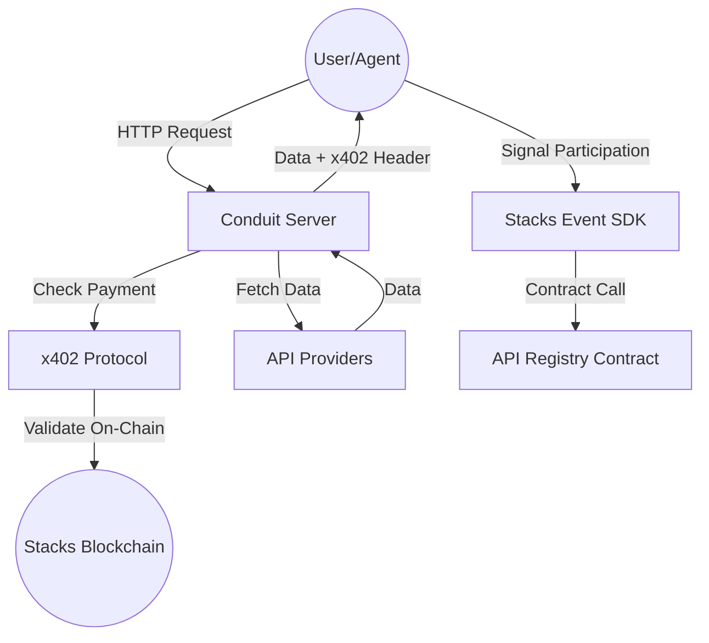

# Conduit Architecture

Conduit is a decentralized API marketplace that enables pay-per-call interactions between AI agents and service providers.

## System Overview

## Components

1.  **Conduit Server**: An Express-based server that acts as a proxy/gateway for paid APIs.
2.  **x402 Protocol**: A payment protocol implemented on Stacks that handles micro-payments for API calls.
3.  **API Registry**: A Clarity smart contract that maintains the list of available APIs and their pricing.
4.  **Stacks Event SDK**: A client-side library for interacting with the marketplace and signaling event participation.

## Payment Flow

1.  Agent discovers an API via `/api/v1/discover`.
2.  Agent makes a request to the API endpoint.
3.  Server responds with `402 Payment Required` and payment details.
4.  Agent pays via the Stacks blockchain.
5.  Agent retries the request with the transaction ID.
6.  Server validates the transaction and returns the data.
